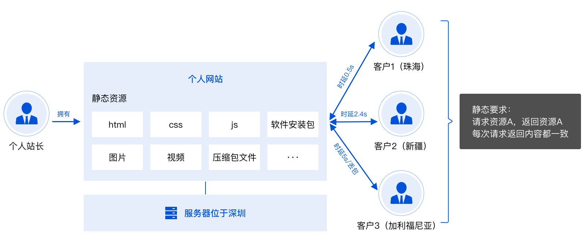
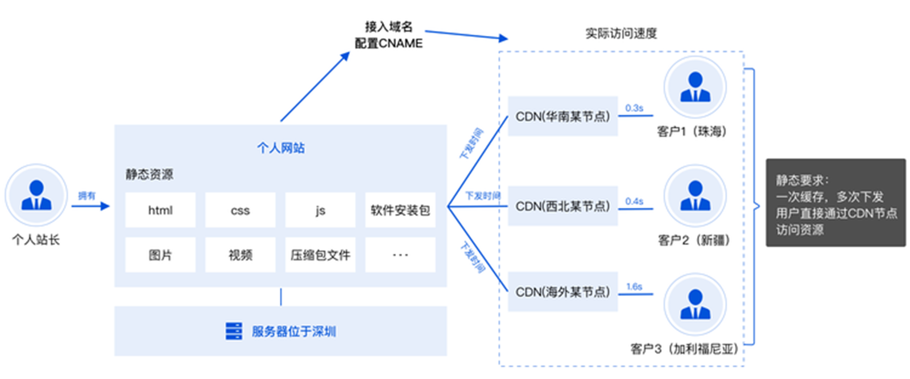
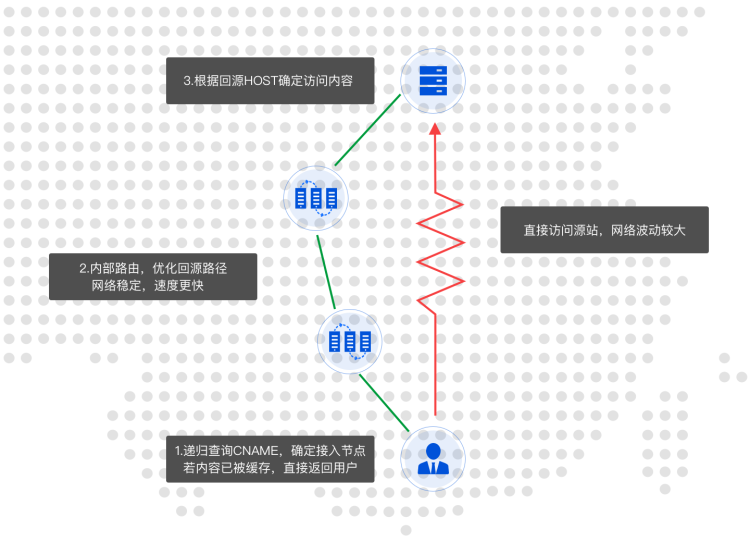

## 一、内容分发网络 CDN
内容分发网络（Content Delivery Network，CDN）是在现有 Internet 中增加的一层新的网络架构，由遍布全球的高性能加速节点构成。这些高性能的服务节点都会按照一定的缓存策略存储您的业务内容，当您的用户向您的某一业务内容发起请求时，请求会被调度至最接近用户的服务节点，直接由服务节点快速响应，有效降低用户访问延迟，提升可用性。  

### 为什么使用 CDN 内容分发网络？
当用户直接访问源站中的静态内容时，可能面临的体验问题：
- 客户离服务器越远，访问速度越慢。
- 客户数量越多，网络带宽费用越高。
- 跨境用户访问体验较差。



### CDN如何改善您的网络体验
- CDN 缓存内容后，用户仅需要访问就近的 CDN 节点即可获取静态内容。
- 缓解源站带宽压力，网络费用更低。
- 分布全球的跨境节点提升跨境访问体验。



### CDN 接入示例



### 参考链接

[内容分发网络 CDN](https://cloud.tencent.com/document/product/228/43827)

## 组件的按需引入

因为使用到的公用组件比较少，采用按需引入的方式，而不是将整个包放到cdn中
```js
import {
  Header,
  Button
} from 'mint-ui'
Vue.use(Header)
Vue.use(Button)
```

## 路由懒加载
```js
{
  path: '/',
  name: 'TopicList',
  component: import('@/components/TopicList')
}
```

## webpack打包优化

## 图片压缩

不建议通过代理服务器设置Gzip的方式进行压缩图片，因为Gzip压缩图片相当于几乎没压缩，所以图片部署之前要先压缩好🎅；或者找UI把图片压缩好发给你。

推荐图片压缩工具

- [光影魔术手](http://www.neoimaging.cn/)
- [tinypng](https://tinypng.com/)